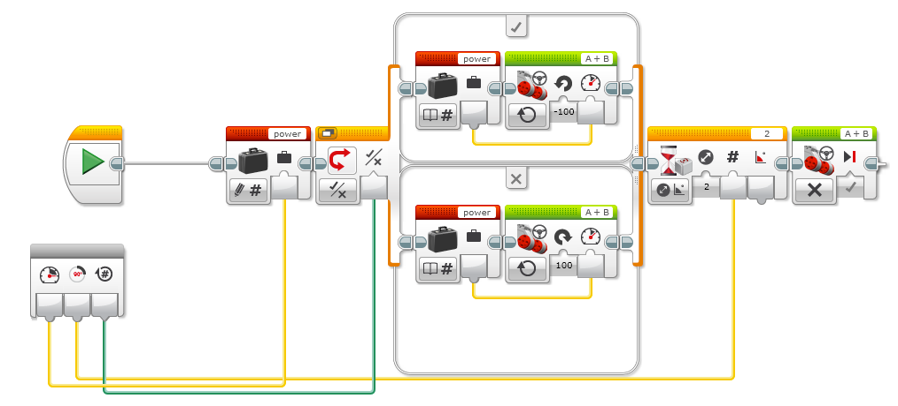

# EV3 Gyro sensor

The digital EV3 Gyro Sensor measures the robot’s rotational motion and changes in its orientation.

Gyroscope Features: 

1. Two separate outputs per axis for high-speed gaming applications and lower-speed menu navigation: 2000°/s full scale range (high-speed gaming) 440°/s full scale range (pointing) • Low bias drift over temperature • On-chip temperature sensor 
2. Temperature sensor Integrated amplifiers & low-pass filters.
3. Dual-mass, vibratory MEMS gyroscope offers superior vibration rejection over a wide frequency range. The dual-mass design inherently rejects any signal caused by linear acceleration. 
4. 10,000 g shock tolerance The Rate-Out of the gyro is not ratiometric to the supply voltage. The scale factor is calibrated at the chip foundry and is nominally independent of supply voltage.

Example1: Turn your robot using a EV3 Gyro sensor.

