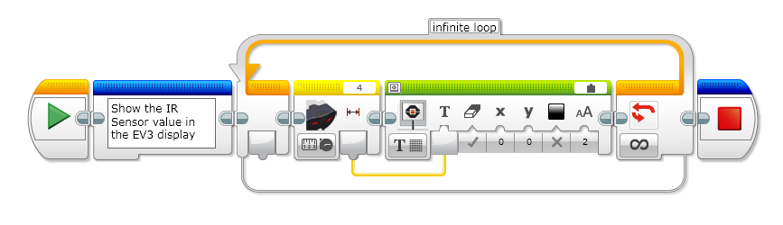
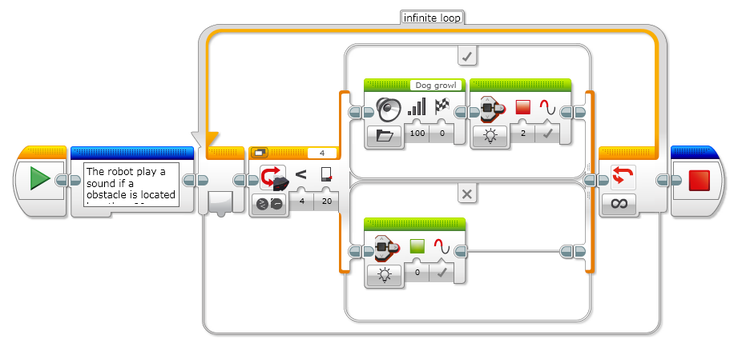
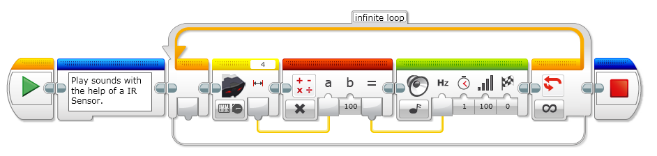

# EV3 Infrared Sensor
The digital EV3 Infrared Seeking Sensor detects proximity to the robot and reads signals emitted by the EV3 Infrared Beacon.

- Some features about this sensor:
- Proximity measurement of approximately 50-70 cm 
- Working distance from the beacon of up to two meters
- Supports four signal channels
- Receives IR remote commands

**How to use the sensor**

Example 1: Show in the display the value of a Infrared sensor.

Example2: Use a Infrared Sensor in a if statement.

Example3: Play sounds with the help of a IR Sensor.

