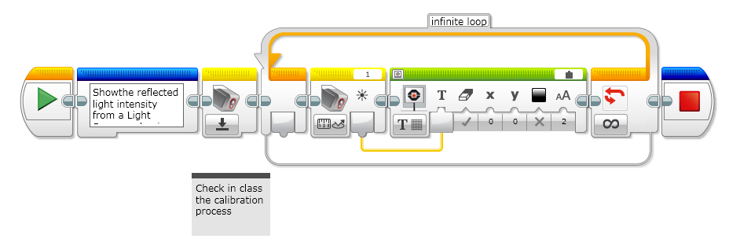

# EV3 Light sensor

The digital EV3 Color Sensor distinguishes between eight different colors. 
It also serves as a light sensor by detecting light intensities. 
Students can build color sorting and line-following robots, experiment with light reflection of different colors, 
and gain experience with a technology that is widely used in industries like recycling, agriculture and packaging. 
The sensor measures reflected red light and ambient light, from darkness to very bright sunlight. 
It is capable of detecting eight colors. It cantell the difference between color or black and white, or between blue, 
green, yellow, red, white and brown.

The range of values for a light sensor measuring the reflected light intensity are:

- Minimum: 0, Black
- Maximum: 100, White

**How to use the sensor**
Example 1: Measure the reflected light intensity from the EV3 light sensor.

