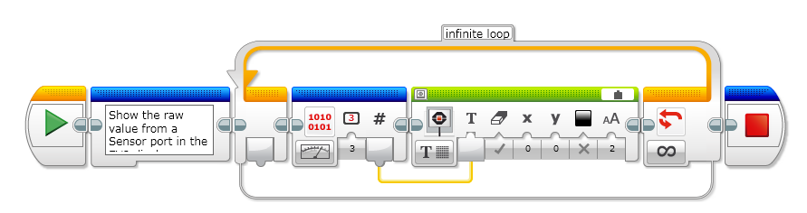

# EV3 Touch sensor

The analog EV3 Touch Sensor is a simple but exceptionally precise tool that detects when its front button is pressed or
 released and is able to count single and multiple presses.
 
 

**How to use the sensor**
Example 1: Show the state from a Touch sensor in the EV3 display

 

Example 2: Example to show how to use a IF statement using a Touch Sensor

 

Example 3: Show the raw value from a Sensor port in the EV3 display

 

