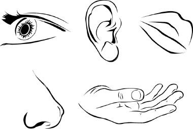

# Sensors

# Introduction
Human being has 5 senses to measure signals from the environment to interact with the world. The senses are: sight, 
hearing, taste, smell and touch.

In robotics, it is possible to add sensors in your robots to get data from environment or internal state of that 
creation to intereact. Robots built with a EV3 has the opportunity to use 4 sensors connected to the brick. 
If you classify the nature of the information which sensors measure, you have 2 groups:

1. “exteroceptors” for the measurement of its environmental (external, from the robot point of view) parameters.
2. “proprioceptors” for the measurement of the robot’s (internal) parameters

**Exteroceptors sensors**
Exteroceptors are sensors that measure the positional or force-type interaction of the robot with its environment. 

**Proprioceptors sensors**
Proprioception in robotics means sensing the internal state of the robot or a part of it . For example the posture of 
a mechanical manipulator, leg or other jointed mechanism or the battery level.
 
## Exteroceptors sensors in EV3

### Introduction
In the market, Lego Mindstorms for EV3 has 2 kits in the market:

**31313**
The set includes the following exteroceptor sensors:

1. [Infrared sensor](ev3_ir_sensor.md) x1
2. [Touch sensor](ev3_touch_sensor.md) x1
3. [Light sensor](ev3_light_sensor.md) x1 

**45554**
The set includes the following exteroceptor sensors:

1. Ultrasonic sensor x1
2. [Touch sensor](ev3_touch_sensor.md) x2
3. [Light sensor](ev3_light_sensor.md) x1
4. [Gyro sensor](ev3_gyro_sensor.md) x1

Besides, in the market exist others exteroceptor sensors from Lego education, Mindsensors, Dexter Laboratories 
and HiTechnics.

## Proprioceptors sensors in EV3

### Introduction

Once you have discovered how to use EV3 sensors to get data from the world, it is necessary to discover other kind 
of sensors used to measure internal state of your own robot.

1. [Gyro sensor](ev3_gyro_sensor.md) x1
2. [Lego Large Motor state](ev3_large_motor.md)
3. Battery
