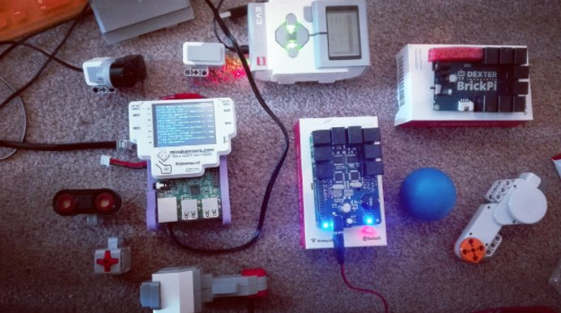

# What is EV3Dev-lang-java?

A project to learn Java and create software for Mindstorms Robots using hardware supported by EV3Dev & the LeJOS way.

## Introduction

Lego Mindstorms ecosystem is
`a fantastic educational way to learn Java, Linux and Robotics` to develop your creativity using your favourite Bricks.
In the the third generation of the product link:https://www.lego.com/en-us/mindstorms[Lego Mindstorms EV3],
others companies like link:https://www.dexterindustries.com/[Dexter Industries]
& link:http://www.mindsensors.com/[Mindsensors] has released boards combining the power of
link:https://www.raspberrypi.org/[Raspberry Pi 3] with the usage of Sensors & Actuators from Lego Mindstorms ecosystem.
The result is very healthy for the Community but... some questions appear in the air:

- How to manage the hardware in an easy way?
- How to continue using Java with all boards?
- What happen with amazing LeJOS libraries about `local-navigation` in this context?

The answer is this project, **EV3Dev-lang-java**.

## Project architecture

The project has been designed with the following solution in mind:

[options="header,footer"]
|===
| Layer            | Option 1                                   | Option 2
| Platforms        | EV3 BrickPi BrickPi3 PiStorms              | EV3
| OS               | Debian Jessie                              | Debian Stretch
| JVM              | Oracle JRE 8                               | OpenJDK JRI 10
| EV3Dev Kernel    | 4.4.47-19-ev3dev-ev3 4.4.47-19-ev3dev-rpi2 | 4.9.58-ev3dev-1.6.0-ev3
| ev3dev-lang-java | 0.7.0                                      | 2.3.0
|===

**Note:** At the moment, the whole solution is scalable until the next `LEGO Mindstorms` product estimated
for next January of 2020.

## Features included

**Java features**

* OpenJDK Java 10 support for EV3 Brick, Brickpi+/PiStorms + Raspberry Pi 3
* Java profiling tools Support (link:http://www.oracle.com/technetwork/java/javaseproducts/mission-control/java-mission-control-1998576.html[Oracle mission control] & link:http://docs.oracle.com/javase/7/docs/technotes/guides/management/jconsole.html[JConsole])
* Logging support based on link:https://www.slf4j.org/[SLF4J]
* Centralized logs with link:https://www.elastic.co/products/kibana[Kibana]

**Platform features**

* Support for EV3 Brick, PiStorms v1/v2, BrickPi+ & BrickPi 3

**Lego Mindstorms features**

* Regulated Motor Support
* Unregulated Motor Support
* Sensor Support (EV3 sensors)
* Sounds Support
* EV3 LCD Support

**Robotics**

* Automatic installation of link:http://opencv.org/[OpenCV]
* link:http://espeak.sourceforge.net/[eSpeak] TTS (Text to speech) Support
* link:http://sourceforge.net/p/lejos/wiki/Sensor%20Framework/[LeJOS Sensor filter] Support
* link:https://github.com/ev3dev-lang-java/lejos-navigation[LeJOS local navigation stack] Support
* link:https://github.com/ev3dev-lang-java/usb-devices[RPLidar A1/A2] (2D Lidar) Support

## Subprojects

Stable projects:

- link:https://github.com/ev3dev-lang-java/ev3dev-lang-java[EV3Dev-lang-java]: Low level interation with EV3Dev
- link:https://github.com/ev3dev-lang-java/lejos-commons[lejos-commons]: LeJOS interfaces & utilities
- link:https://github.com/ev3dev-lang-java/installer[Installer]: A set of Bash scripts to automate some operations with your brick
- link:https://github.com/ev3dev-lang-java/template_project_gradle[Template project]: A Gradle project ready to test the project
- link:https://github.com/ev3dev-lang-java/examples[Examples]: A repository with several examples about the usage of this project

Incubator projects:

- link:https://github.com/ev3dev-lang-java/lejos-navigation[lejos-navigation]: LeJOS navigation stack
- link:https://github.com/ev3dev-lang-java/batteryMonitor[Battery Monitor]: A battery monitor to protect your hardware against low battery levels
- link:https://github.com/ev3dev-lang-java/openjdk-ev3[OpenJDK for EV3]: A custom OpenJDK JRE build for EV3
- link:https://github.com/ev3dev-lang-java/usb-devices[Usb Devices]: A library to use Arduino, Grove Sensors, GPS, IMU, LIDAR, and more devices...
- link:https://github.com/ev3dev-lang-java/ros[ROS]: A library to publish Sensor data to ROS for SLAM purposes

## Competitive advantages

The competitive advantages of this project are:

* Support for Multiple Bricks like EV3 Brick, BrickPi & PiStorms
* Support for `USB` Connections for Sensors like 2D LIDARs, IMU & GPS & `Arduino` Boards
* Usage of `LeJOS` interfaces

If you analyze the hardware, any EV3 Brick uses a
`SoC: Sitara Processor AM1808` (from year 2010) to manage Sensors &
Actuators but now with the usage of a BrickPi/PiStorms unit, it is
possible to use the power of a Raspberry Pi 3 increasing the
possibilities to develop complex projects which require por
Computational consumption.

[options="header,footer"]
|=======================
| Element  | LEGO                                                                                     | Raspberry Pi 3 Model B+
| Hardware | EV3 Brick                                                                                | BrickPi+  BrickPi3 PiStorms
| SoC      | Sitara Processor AM1808                                                                  | Broadcom BCM2837 RISC de 64 bits
| CPU      | ARM9 300MHz                                                                              | 4× ARM Cortex-A53, 1.4GHz
| RAM      | 16KB of Instruction Cache,  16KB of Data Cache,  8KB of RAM (Vector Table),  64KB of ROM | 1GB LPDDR2 (900 MHz)
| USB      | 1x                                                                                       | 4x
| Year     | 2010                                                                                     | 2018
|=======================

## Timeline of the project

In 2015, EV3Dev was born to offer a solution to install a complete
link:https://www.debian.org[Linux Debian Operating System] on
link:https://www.lego.com/en-us/mindstorms[EV3 Brick],
link:https://www.dexterindustries.com/brickpi/[BrickPi Series] &
link:http://www.mindsensors.com/content/78-pistorms-lego-interface[PiStorms Series].
The project provides an agnostic Linux interface to unify the way to interact with Mindstorms Hardware too.

At the end of the same year, `EV3Dev-lang-java` was born with the idea to continue developing Java robots
on Lego Mindstorms and providing a port of `LeJOS` libraries like the `local-navigation` stack.

In the future, we will add the `remote` support and `ROS` support.

## Evolution of Java on Lego Mindstorms ecosystem

LeJOS project is the unique Open Source project available for every Lego Mindstorms generations of the product.
In any generation, the project had to find a solution for the following layers:

* Runtime
* JVM
* Robotics libraries

This premise was solved in every Mindstorms generation:

[options="header,footer"]
|=======================
|Product             | RCX               | NXT                           | EV3 + LeJOS                 | EV3/BrickPi/PiStorms + EV3Dev-lang-java
|Runtime             | Custom firmware   | Custom firmware               | Busybox + Native libraries  | Debian Jessie/Stretch
|JVM                 | Custom JVM        | Custom JVM                    | Oracle JRE 8                | OpenJDK 10
|Robotics libraries  | Initial libraries | local-navigation, remote, ros | local-navigation, remote    | local-navigation
|Last release        | 17/12/2006        | 03/02/2015                    | 16/11/2015                  | 23/04/2018
|=======================

++++

++++