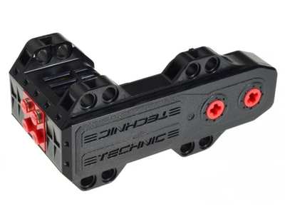

# Actuators

## Introduction

An "actuator” can be defined as a device that converts energy
(in robotics, that energy tends to be electrical)
into physical motion or a determined output like a visualization
in a Display or the generation of a Sound.

## Motors

### Regulated Motors

image:ev3_large_motor.png[ScreenShot]

Further information about link:regulated-motors.html[Regulated motors]

### Unregulated Motors

Further information about link:unregulated-motors.html[Unregulated motors]
