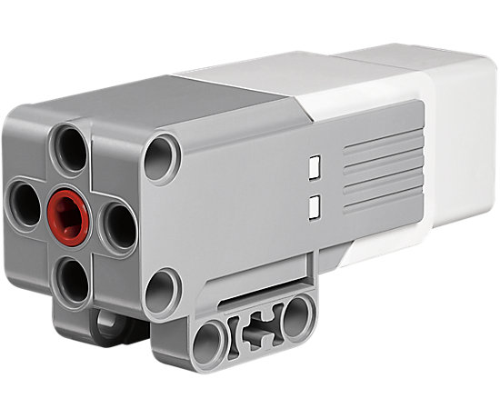
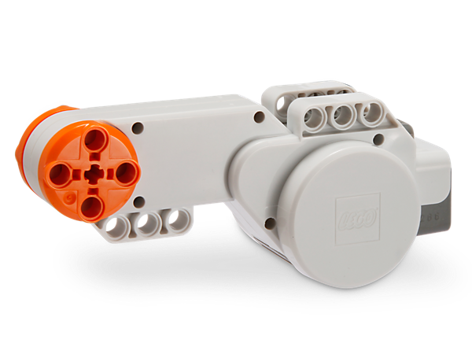

# Actuators

## Introduction

## Regulated Motors

**EV3 Large Motor**

image:ev3_large_motor.png[ScreenShot]

**EV3 Medium Motor**

**NXT Motor**

## How to use the regulated motor

### Move a motor

[source,java]
----
include::LargeMotorDemo.java[]
----

### Forward & Backward

[source,java]
----
include::LargeMotorDemo2.java[]
----

### Test the different stop modes

[source,java]
----
include::LargeMotorStopModesExample.java[]
----

### Multiple motors

[source,java]
----
include::MultipleMotorsDemo.java[]
----

### Motor events

[source,java]
----
include::MotorEventTest.java[]
----

### Rotating a motor

[source,java]
----
include::RegulatedMotorRotateDemo.java[]
----

### Rotating to a specific angle

[source,java]
----
include::RegulatedMotorRotateToDemo.java[]
----

## Unregulated Motors

**RCX Motors**

image:rcx-motor.jpg[ScreenShot]

**Lego Technics Motor**

image:technic-motor.jpg[ScreenShot]

## How to use the regulated motor

### Move a motor

[source,java]
----
include::UnregulatedMotorDemo.java[]
----

### Move multiple motors

[source,java]
----
include::UnregulatedMutipleMotorDemo.java[]
----
