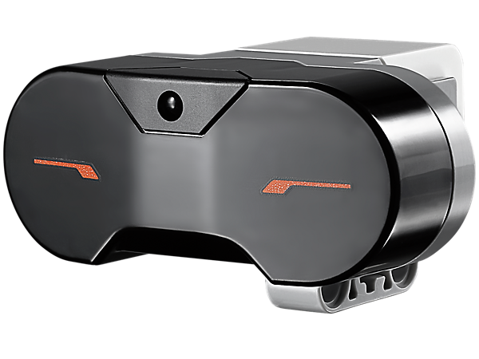

# The robot architecture

## Introduction

Any Robot is based on the combination of Software & Hardware.
The `Architecture` of any robot is based on the following components:

* Control System
* Sensors
* Actuators
* Power supply

### Control System

The pure definition of a `Control system` is:

TIP: "A control system manages, commands, directs or regulates the behaviour of other devices or systems."

In a Mindstorms context, the Control System is the Brick we use to create Robots.

image:ev3-brick.png[image]

### Sensors

Sensors measure a physical quantity, and convert it into a usable signal for your control systen.
When you are designing the robot it is important to choose the correct sensors to enable it to be aware of
its environment and perform the tasks required.

In a Mindstorms context, an Actuator is the EV3 IR Sensor:

### Actuators

An “actuator” can be defined as a device that converts energy (in robotics, that energy tends to be electrical)
into physical motion. The vast majority of actuators produce either rotational or linear motion.

In a Mindstorms context, an Actuator is the EV3 Large Motor:

### Power supply

An electric battery is a device consisting of one or more electrochemical cells with external connections
provided to power electrical devices.

In a Mindstorms context, the Battery is this element:

image:ev3-battery.jpg[image]

The rechargeable battery run in combination with the power adapter:

**References:**

- https://www.cs.cmu.edu/~chuck/robotpg/robofaq/9.html
- http://sciencing.com/main-parts-robot-7403157.html
- https://en.wikipedia.org/wiki/Control_system
- https://en.wikipedia.org/wiki/Robotic_sensors
- http://www.robotshop.com/blog/en/how-to-make-a-robot-lesson-3-actuators-2-3703
- https://en.wikipedia.org/wiki/Battery_(electricity)
- https://en.wikipedia.org/wiki/Power_supply
- http://www.societyofrobots.com/batteries.shtml

++++

++++