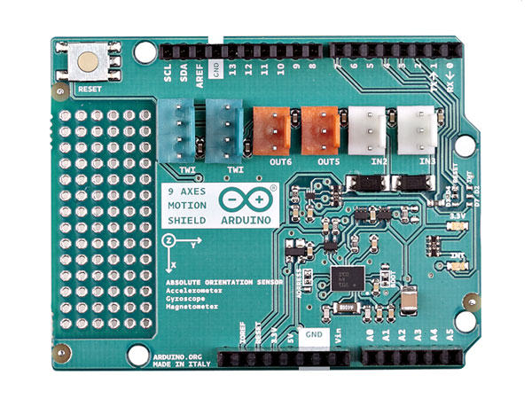

# Arduino 9 axes motion shield (BNO055)

## Introduction

The sensor BNO055 is an excellent MEMS IMU and Arduino has a Shield to manage the sensor.
https://www.bosch-sensortec.com/bst/products/all_products/bno055

## NAxesMotion API

* void resetSensor(unsigned int address);
* void setOperationMode(byte operationMode);
* void setPowerMode(byte powerMode);
* void updateAccel(void);
* void updateMag(void);
* void updateGyro(void);
* void updateQuat(void);
* void updateEuler(void);
* void updateLinearAccel(void);
* void updateGravAccel(void);
* void updateCalibStatus(void);
* void writeAccelConfig(uint8_t range, uint8_t bandwidth, uint8_t powerMode);
* void updateAccelConfig(void);
* void accelInterrupts(bool xStatus, bool yStatus, bool zStatus);
* void resetInterrupt(void);
* void enableAnyMotion(uint8_t threshold, uint8_t duration);
* void disableAnyMotion(void);
* void enableSlowNoMotion(uint8_t threshold, uint8_t duration, bool motion);
* void disableSlowNoMotion(void);
* void setUpdateMode(bool updateMode);
* float readAccelX(void);
* float readAccelY(void);
* float readAccelZ(void);
* float readGyroX(void);
* float readGyroY(void);
* float readGyroZ(void);
* float readMagX(void);
* float readMagY(void);
* float readMagZ(void);
* int16_t readQuatW(void);
* int16_t readQuatX(void);
* int16_t readQuatY(void);
* int16_t readQuatZ(void);
* float readEulerHeading(void);
* float readEulerRoll(void);
* float readEulerPitch(void);
* float readLinearAccelX(void);
* float readLinearAccelY(void);
* float readLinearAccelZ(void);
* float readGravAccelX(void);
* float readGravAccelY(void);
* float readGravAccelZ(void);
* uint8_t readAccelCalibStatus(void);
* uint8_t readGyroCalibStatus(void);
* uint8_t readMagCalibStatus(void);
* uint8_t readSystemCalibStatus(void);
* uint8_t readAccelRange(void);
* uint8_t readAccelBandwidth(void);
* uint8_t readAccelPowerMode(void);

## Arduino Sketch

[source,arduino]
----
include::_9axis.ino[]
----

## How to use the sensor

[source,java]
----
include::BNO055TurnTest.java[]
----