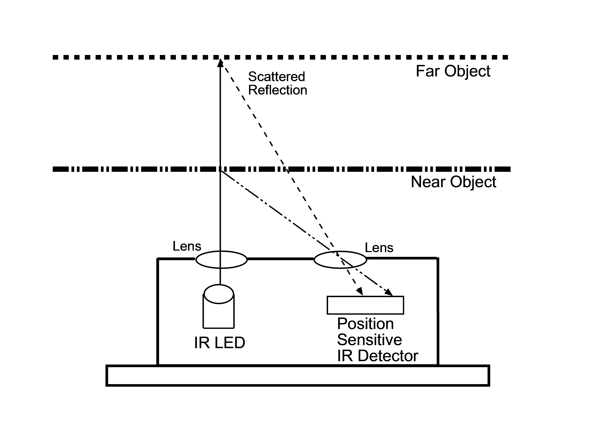

# EV3 Rangefinder sensors

# Introduction

A rangefinder is a device that measures the distance from the observer to a target, in a process called ranging.

# EV3 Sensors

In Lego Mindstorms ecosystem, exist 2 Rangefinder sensors:

* link:ev3-us-sensor/ev3_us_sensor.html[EV3 Ultrasonic sensor]
* link:ev3-ir-sensor/ev3_ir_sensor.html[EV3 Infrared sensor]

**References:**

https://en.wikipedia.org/wiki/Rangefinder
