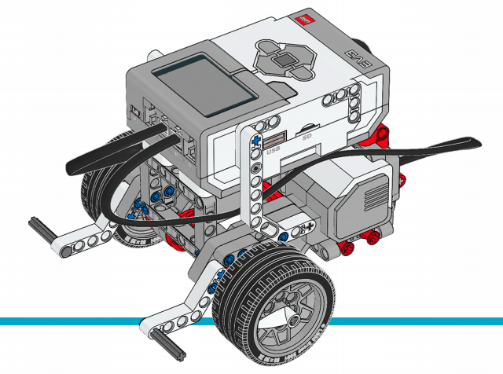

# Create your first Project

## Introduction

Create your first project is not complicated but the process requires time and this is the reason to
develop a `Template project` using `Gradle`.

The advantages of the usage of the Template project are:

 * Build System configured
 * Dependencies defined
 * Tasks defined to interact with the Brick

Further information about `Template project` link:https://github.com/ev3dev-lang-java/template-project-gradle[here]

## Create your first project using the Gradle template project

### Clone/Download the project in your computer

The project `Template project` is hosted on Github and it possible to download the content of a Git branch or
execute the following statement to clone the project in local.

```
git clone https://github.com/ev3dev-lang-java/template_project_gradle.git
```

Now you have you have in local the project.
Open the project with your favourite Java IDE.

### Configure the Brick IP

In the project opened, open the file: `config.gradle`: to update IP of you Brick connected to the network
where your computer is connected:

```
remotes {
    ev3dev {
        host = '10.0.1.3'
        user = 'robot'
        password = 'maker'
    }
}
```

to check that the Java IDE connects with the Brick, execute the following Gradle task:

```
./gradlew testConnection
```

If the execution of the task was successfully then your computer has a direct connection with your Brick.

### Deploy the default program

The template project includes a Default program named `MyFirstRobot.java`.
The example was designed to move a Mobile Robot with 2 motors connected to Port A & Port B.
If you need inspiration to create your Physical robot, `LEGO Education` provides some excellent
link:https://education.lego.com/en-us/support/mindstorms-ev3/building-instructions[Building Instructions Guides]



Follow the link:https://le-www-live-s.legocdn.com/sc/media/lessons/mindstorms-ev3/building-instructions/ev3-rem-driving-base-79bebfc16bd491186ea9c9069842155e.pdf[link] to build the Base Robot.


*MyFirstRobot.java*

[source,java]
----
include::MyFirstRobot.java[]
----

To deploy the example on your brick, open a `terminal` and type:

```
./gradlew deployAndBrickRun
```

### Add a new Java program

Once you feel comfortable with the Template project and the Gradle Tasks, you could feel the need to add your
own program. In this case, add in the project the new Java file like this one:

*HelloWorld.java*

[source,java]
----
include::HelloWorld.java[]
----

In order to run the new program, you will have to open the file MANIFEST.MF and update the field about `Main-Class`
indicating the new class, in this case `HelloWorld`

[source,java]
----
include::MANIFEST.MF[]
----

To deploy the new example on your brick, open a `terminal` and type:

```
./gradlew deployAndBrickRun
```

## Create your first project from scratch

Another alternative is the creation of a project from Scratch using Maven/Gradle.

To start a new project with this library, add the following repository and dependency.

```xml
<repositories>
    <repository>
        <id>jitpack.io</id>
        <url>https://jitpack.io</url>
    </repository>
</repositories>
```

``` xml
<dependency>
    <groupId>com.github.ev3dev-lang-java</groupId>
    <artifactId>ev3dev-lang-java</artifactId>
    <version>2.4.16</version>
</dependency>
```
	
Further information about link:https://jitpack.io/#ev3dev-lang-java/ev3dev-lang-java/2.4.16[the dependency]

## Playing with more examples

The project has a repository with several examples about the usage of the different libraries.

Visit the link:https://github.com/ev3dev-lang-java/examples[repository about examples] to download and test more examples.

## The Next Step

Continue with the next section about: link:../#fundamentals-of-robotics[Fundamentals of Robotics]

++++

<script>
    (function(i,s,o,g,r,a,m){i['GoogleAnalyticsObject']=r;i[r]=i[r]||function(){
    (i[r].q=i[r].q||[]).push(arguments)},i[r].l=1*new Date();a=s.createElement(o),
    m=s.getElementsByTagName(o)[0];a.async=1;a.src=g;m.parentNode.insertBefore(a,m)
    })(window,document,'script','//www.google-analytics.com/analytics.js','ga');

    ga('create', 'UA-343143-18', 'auto');
    ga('send', 'pageview');
</script>
++++
