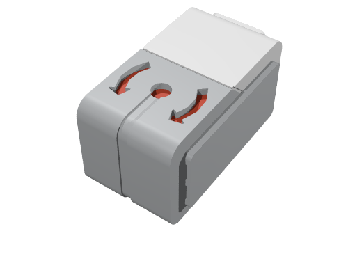
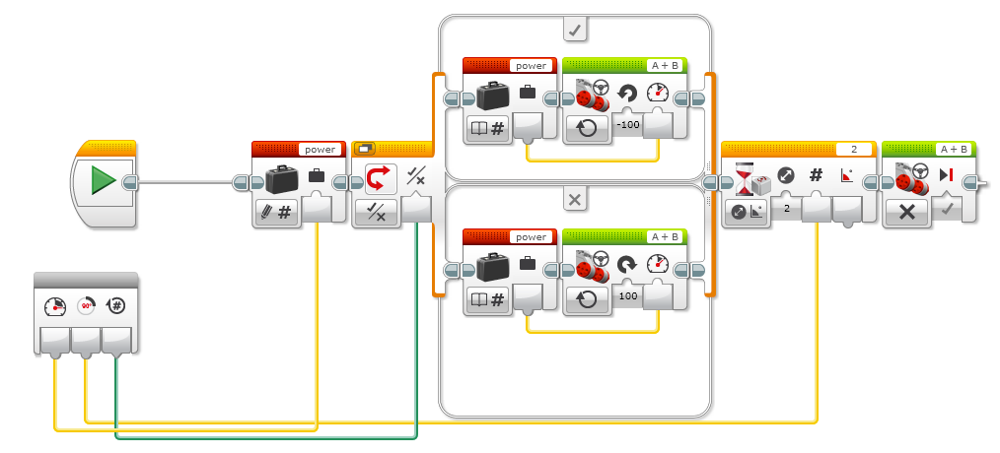

# EV3 Gyro sensor

The digital EV3 Gyro Sensor measures the robot’s rotational motion and changes in its orientation.

Gyroscope Features: 

. Two separate outputs per axis for high-speed gaming applications and lower-speed menu navigation: 2000°/s full scale range (high-speed gaming) 440°/s full scale range (pointing) • Low bias drift over temperature • On-chip temperature sensor
. Temperature sensor Integrated amplifiers &amp; low-pass filters.
. Dual-mass, vibratory MEMS gyroscope offers superior vibration rejection over a wide frequency range. The dual-mass design inherently rejects any signal caused by linear acceleration.
. 10,000 g shock tolerance The Rate-Out of the gyro is not ratiometric to the supply voltage. The scale factor is calibrated at the chip foundry and is nominally independent of supply voltage.

Example1: Turn your robot using a EV3 Gyro sensor.

[source,java]
----
include::./GyroSensorDemo.java[]
----

[source,java]
----
include::./GyroSensorDemo2.java[]
----

[source,java]
----
include::./GyroSensorDemo3.java[]
----

++++

++++