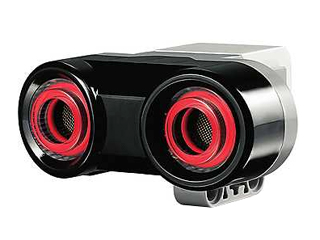

# EV3 Ultrasonic Sensor

## Introduction

The digital EV3 Ultrasonic Sensor generates sound waves and reads their echoes to detect and measure distance from objects. It can also send single sound waves to work as sonar or listen for a sound wave that triggers the start of a program. Students could design a traffic-monitoring system and measure distances between vehicles, for instance. There is an opportunity to discover how the technology is used in everyday items like automatic doors, cars and manufacturing systems.

* Measures distances between one and 250 cm
* Front illumination is constant while emitting and blinks while listening

## How to use the sensor

### Example to read distances

[source,java]
----
include::./USSensorDemo.java[]
----

### Example to use the Listen Mode

[source,java]
----
include::./USSensorDemo2.java[]
----

**References**

https://shop.lego.com/en-GB/EV3-Ultrasonic-Sensor-45504

