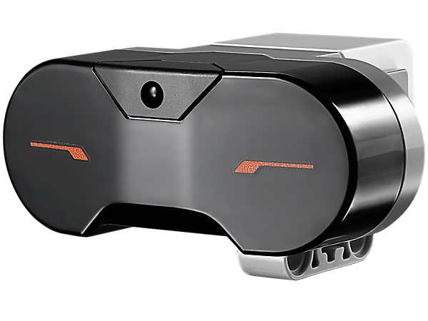
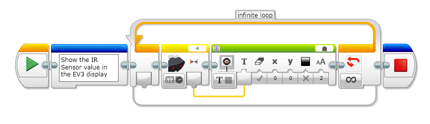
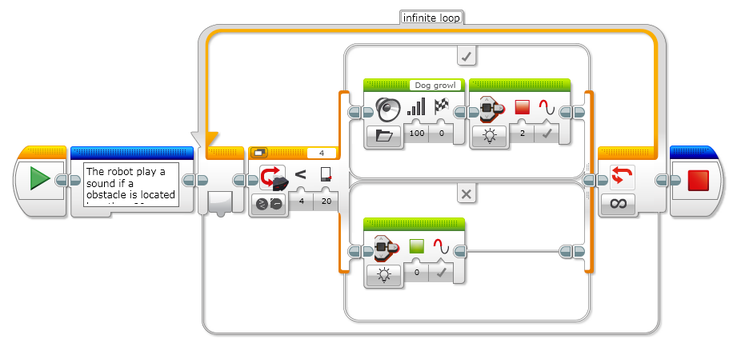
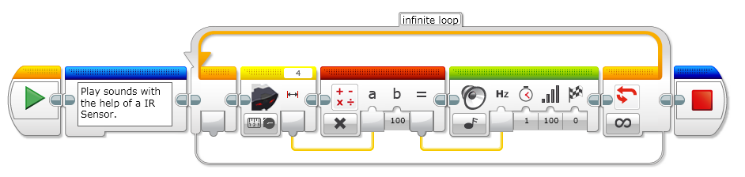

= EV3 Infrared Sensor

The digital EV3 Infrared Seeking Sensor detects proximity to the robot and reads signals emitted by the EV3 Infrared Beacon.

* Some features about this sensor:
* Proximity measurement of approximately 50-70 cm
* Working distance from the beacon of up to two meters
* Supports four signal channels
* Receives IR remote commands

*How to use the sensor*

Example 1: Show in the display the value of a Infrared sensor.

Example2: Use a Infrared Sensor in a if statement.

Example3: Play sounds with the help of a IR Sensor.

[source,java]
----
include::./IRSensorDemo.java[]
----

[source,java]
----
include::./IRSensorDemo2.java[]
----

[source,java]
----
include::./IRSensorDemo3.java[]
----

++++

++++