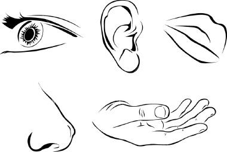
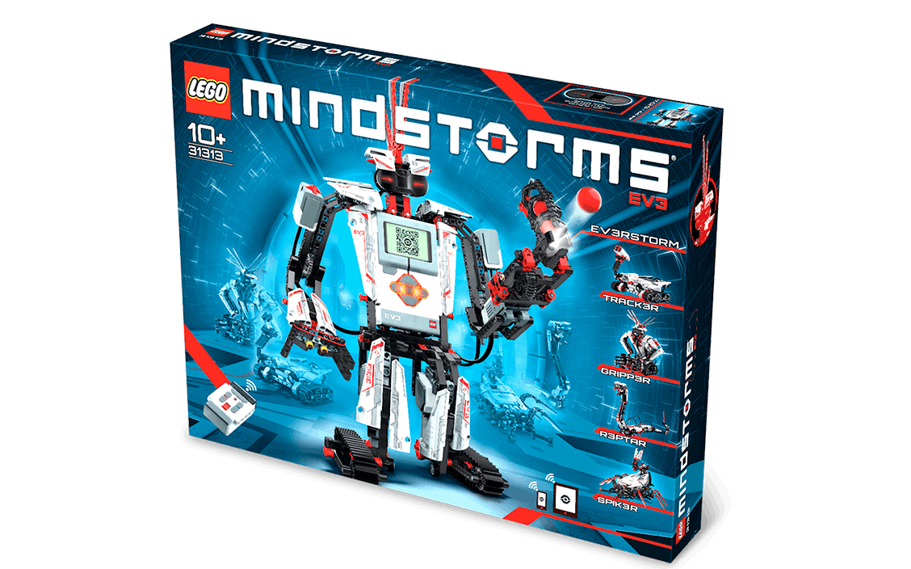
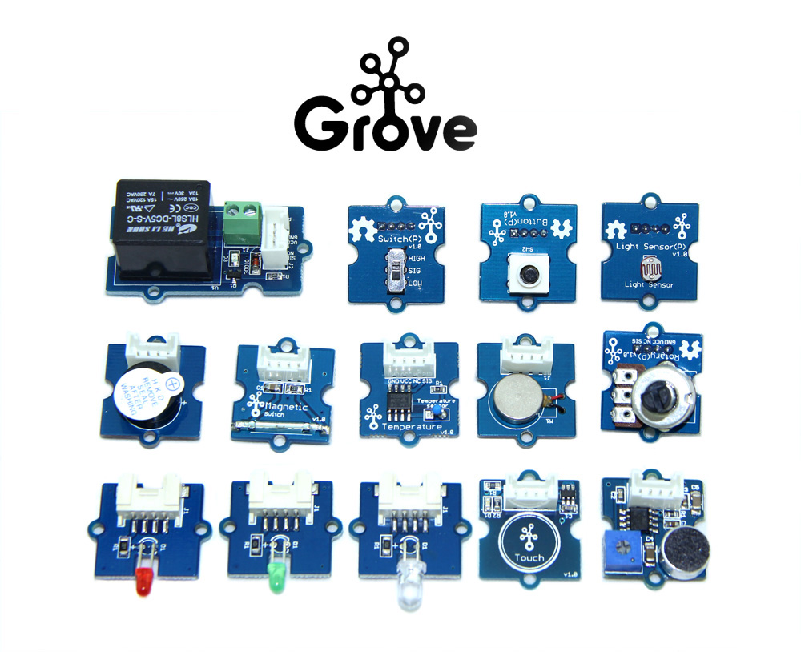

# Sensors

## Introduction

A human being has 5 senses to measure signals from the environment to interact with the world.
The senses are: sight, hearing, taste, smell and touch.

In same way, in a Robot, it is possible to use sensors in your robots to get data from environment or
 the internal state of itself. If you classify the nature of the information which sensors measure, you have 2 groups:

* **Exteroceptors Sensors** measure the environment from the robot point of view.
* **Proprioceptors Sensors** measure the internal state of robot (For example the battery level).

### Exteroceptors sensors

* link:ev3_us_sensor.html[Ultrasonic sensor]
* link:ev3_ir_sensor.html[Infrared sensor]
* link:ev3_touch_sensor.html[Touch sensor]
* link:ev3_light_sensor.html[Light sensor]

### Proprioceptors sensors

* link:ev3_large_motor.html[Lego Large Motor state]
* link:battery.html[Battery Sensor]

## Source of sensors

### LEGO 31313 Kit

This Lego Mindstorms Kit include the following sensors:

* link:ev3_ir_sensor.html[Infrared sensor] x1
* link:ev3_touch_sensor.html[Touch sensor] x1
* link:ev3_light_sensor.html[Light sensor] x1
* link:ev3_large_motor.html[Lego Large Motor state]
* link:battery.html[Battery Sensor]

### LEGO 45544 Kit

The Kit includes the following sensors:

* link:ev3_us_sensor.html[Ultrasonic sensor] x1
* link:ev3_touch_sensor.html[Touch sensor] x2
* link:ev3_light_sensor.html[Light sensor] x1
* link:ev3_gyro_sensor.html[Gyro sensor] x1
* link:ev3_large_motor.html[Lego Large Motor state]
* link:battery.html[Battery Sensor]

### Dexter Industries BrickPi3/BrickPi+

The Kit includes the following sensors:

* link:battery.html[Battery Sensor]
* Grove Adapter (Only for BrickPi3)

image:./brickpi3.jpg[image]

### Mindsensors PiStorms

The Kit includes the following sensors:

* link:battery.html[Battery Sensor]

image:./pistorms-v2.jpg[image]

### Mindsensors Sensors

* AbsoluteIMU
* Grove Sensor Adapter for EV3
* Vision Subsystem v5

### USB Webcams

image:./logitech-webcam.png[image]

### Grove Sensors

### Slamtec Sensors

* 2D LIDAR RPlidar A1
* 2D LIDAR RPlidar A2

image:./slamtec-rplidar-a2.png[image]