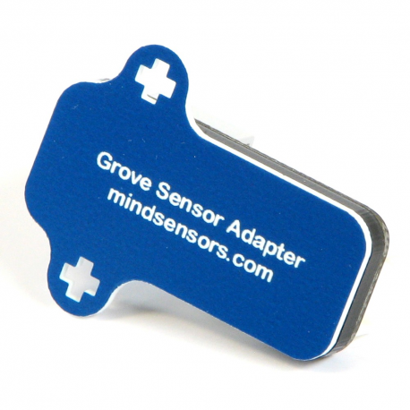
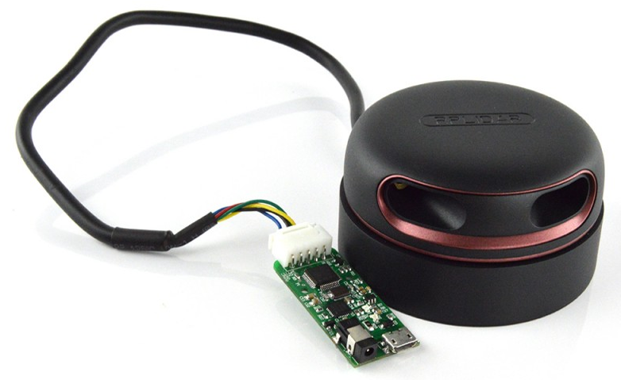

# Sensors

## Introduction

A human being receives signals continuously from his 5 senses (sight, hearing, taste, smell and touch)
and that stream of data are processed or discarded by the Brain.

image:images//humanSenses.png[image]

With a Robot occurs the same, when you plug a sensor in the brick, your program is able to process
a new kind of data from the environment.
If you classify the nature of the information which sensors measure, exist the following categories:

* **Exteroceptors Sensors** measure the environment from the robot point of view.
* **Proprioceptors Sensors** measure the internal state of robot (For example the battery level).

### Exteroceptors sensors

The following sensors are designed to measure the environment.

* link:ev3-us-sensor/ev3_us_sensor.html[EV3 Ultrasonic sensor]
* link:ev3-ir-sensor/ev3_ir_sensor.html[EV3 Infrared sensor]
* link:ev3-touch-sensor/ev3_touch_sensor.html[EV3 Touch sensor]
* link:ev3-light-sensor/ev3_light_sensor.html[EV3 Light sensor]

### Proprioceptors sensors

The following sensors are designed to measure the internal state of the robot.

* link:ev3-gyro-sensor/ev3_gyro_sensor.html[EV3 Gyro sensor]
* link:ev3-motors/ev3_large_motor.html[EV3 Lego Large Motor state]
* link:ev3-motors/ev3_medium_motor.html[EV3 Lego Medium Motor state]
* link:battery/index.html[Battery Sensor]

## Source of sensors

The Bricks has several ways to interact with sensors from many different sources.

### LEGO 31313 Kit

This Lego Mindstorms Kit include the following sensors to play with them:

* link:ev3-ir-sensor/ev3_ir_sensor.html[EV3 Infrared sensor] x1
* link:ev3-touch-sensor/ev3_touch_sensor.html[EV3 Touch sensor] x1
* link:ev3-light-sensor/ev3_light_sensor.html[EV3 Light sensor] x1
* link:ev3-motors/ev3_large_motor.html[EV3 Lego Large Motor state] x2
* link:ev3-motors/ev3_medium_motor.html[EV3 Medium Motor state] x1
* link:battery/index.html[Battery Sensor]

### LEGO 45544 Kit

This Lego Mindstorms Kit include the following sensors to play with them:

* link:ev3-us-sensor/ev3_us_sensor.html[EV3 Ultrasonic sensor] x1
* link:ev3-touch-sensor/ev3_touch_sensor.html[EV3 Touch sensor] x2
* link:ev3-light-sensor/ev3_light_sensor.html[EV3 Light sensor] x1
* link:ev3-gyro-sensor/ev3_gyro_sensor.html[EV3 Gyro sensor] x1
* link:ev3-motors/ev3_large_motor.html[EV3 Lego Large Motor state] x2
* link:ev3-motors/ev3_medium_motor.html[EV3 Medium Motor state] x1
* link:battery/index.html[Battery Sensor]

image:images//45544.png[image]

### Dexter Industries BrickPi

The Kit includes the following sensors:

* link:battery/index.html[Battery Sensor]
* Grove Adapter (Only for BrickPi3)

image:images//brickpi3.jpg[image]

### Mindsensors PiStorms

The Kit includes the following sensors:

* link:battery/index.html[Battery Sensor]

image:images//pistorms-v2.jpg[image]

### Mindsensors Sensors

Mindsensors is a classic sensor manufacturer and it is possible use with the Robot the following sensors:

* AbsoluteIMU
* Grove Sensor Adapter for EV3

TIP: In the future, the list will grow.

### USB Webcams

USB Cameras is another way to measure the world.
Using OpenCV, it is possible to manage a webcam with Java.

* link:usb-webcam/index.html[OpenCV & Webcams]

image:images/logitech-webcam.png[image]

### Grove Sensors

Grove System, offer a rich set of sensors to measure the environment.

image:images/grove-system.jpg[image]

The sensors are possible to connect with your brick in the following ways:

* EV3: Using the Mindsensors Grove Sensor Adapter for EV3
* BrickPi+: Using the Mindsensors Grove Sensor Adapter for EV3
* PiStorms V2: Using the Mindsensors Grove Sensor Adapter for EV3
* BrickPi 3: It is possible to connect a sensor directly.

### Slamtec Sensors

* link:usb-rplidar/index.html[2D LIDAR RPlidar A1]
* 2D LIDAR RPlidar A2

++++

++++
